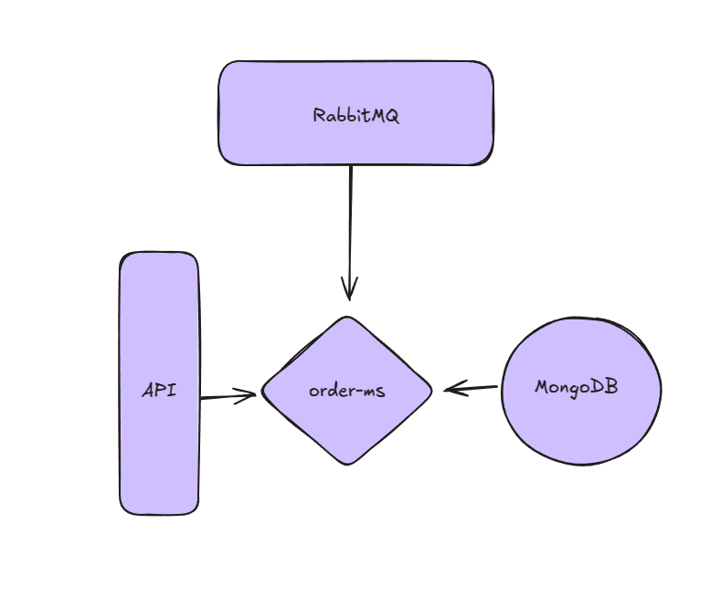

# OrderMS


[](./LICENSE)

O microserviço 'order-ms' processa pedidos recebidos a partir de mensagens na fila do RabbitMQ. Ele se comunica com a API para receber requisições e armazena os dados processados no banco de dados.

## Arquitetura
!

## Documentação API

#### List Orders

```http
  GET customers/{customerId}/orders
```

| Parameter | Type     | Description                |
| :-------- | :------- | :------------------------- |
| `customerId` | `Long` | **Required** customerId |

#### Response

```code
{
  "summary": {
    "totalOnOrders": 120
  },
  "data": [
    {
      "orderId": 1001,
      "customerId": 1,
      "total": 120
    }
  ],
  "pagination": {
    "page": 0,
    "pageSize": 10,
    "totalElements": 1,
    "totalPages": 1
  }
}
```


## Instalação

Clone o projeto

```bash
  git clone https://github.com/Lucas-barreto1/order-ms.git
```

Entre no diretorio 'local' e rode o docker

```bash
  cd ./local
  docker compose up
```
